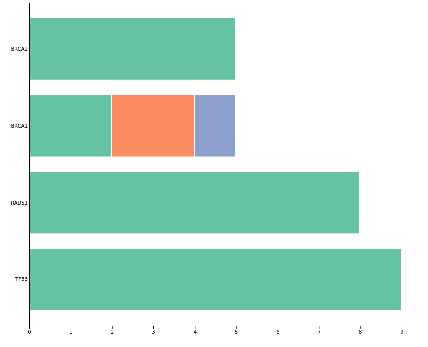

# easy-stacked-bar

A simple package for generating D3 horizontal stacked barplots



## Installation

Install the latest release from npm

`npm install easy-stacked-bar`


## Quick Start

```{javascript}
import * as d3 from "d3";
import { stackedBarHorizontal, count, dputJS } from "easy-stacked-bar";

const data = [
    {
      gene: "BRCA2",
      missense: 5,
      nonsense: 0,
      multiple: 0,
    },
    {
      gene: "BRCA1",
      missense: 2,
      nonsense: 2,
      multiple: 1,
    },
    {
      gene: "RAD51",
      missense: 8,
      nonsense: 0,
      multiple: 0,
    },
    {
      gene: "TP53",
      missense: 9,
      nonsense: 0,
      multiple: 0,
    }
  ];


const chart = stackedBarHorizontal()
    .data(data) // Set the data
    .positionTopLeft([50, 50]) // Set the top left position
    .positionBottomRight([800, 700]) // Set the bottom right position
   //.yScale(yScale) // Optionally use a pre-computed yScale

// Create SVG
const svg = d3
   .select("body")
   .append("svg")
   .attr("width", window.innerWidth)
   .attr("height", window.innerHeight)

// Create Chart
const stackedBarChart = chart(svg) // Render the chart

```


## Counting Long Data

Sometimes your data is not summarised in the wide 'count' format `stackedBarChart()` expects. 
If your data is in a long-form, use `count()` to produce the required wide-count format.

How count works is easiest to understand using an example:


```{javascript}
// Input Data
const longData = [
   { x: "Patient1", gene: "BRCA1", type: "missense" },
   { x: "Patient2", gene: "BRCA1", type: "missense" },
   { x: "Patient3", gene: "BRCA1", type: "nonsense" },
   { x: "Patient4", gene: "BRCA1", type: "nonsense" },
   { x: "Patient5", gene: "TP53", type: "missense" },
   { x: "Patient6", gene: "TP53", type: "missense" },
   { x: "Patient6", gene: "TP53", type: "nonsense" }
 ];
 const dataCounts = count(longData, 'gene', 'type');

 console.log(dataCounts);

 // Output:
 // [
 //   {"gene": "BRCA1", "missense": 2, "nonsense": 2 },
 //   {"gene": "TP53",  "missense": 2, "nonsense": 1 }
 // ]
```


## Key Methods of `stackedBarHorizontal`

The `stackedBarHorizontal` function is used to create a stacked horizontal bar chart. It allows you to customize various aspects of the chart's appearance and behavior.

- `data(data: Array<Object>): StackedBarHorizontal`
  - Sets the data for the chart. Expects an array of objects where each object represents a data point with categories and subcategories.

- `pixelGapBetweenStacks(pixelGap: number): StackedBarHorizontal`
  - Sets the gap between stacked bars in pixels.

- `positionTopLeft(position: [number, number]): StackedBarHorizontal`
  - Sets the top left position of the chart relative to the top of the y-axis line.

- `positionBottomRight(position: [number, number]): StackedBarHorizontal`
  - Sets the bottom right position of the chart relative to the right of the x-axis line.

- `yScale(scale: d3.scaleBand): StackedBarHorizontal`
  - Sets a pre-computed yScale for the chart. Allows you to provide a custom y-axis scale.

- `hideAxisX(): StackedBarHorizontal`
  - Hides the x-axis of the chart.

- `showAxisX(): StackedBarHorizontal`
  - Shows the x-axis of the chart.

- `hideAxisY(): StackedBarHorizontal`
  - Hides the y-axis of the chart.

- `showAxisY(): StackedBarHorizontal`
  - Shows the y-axis of the chart.

- `yTickSize(tickSize: number): StackedBarHorizontal`
  - Sets the tick size for the y-axis.

- `yTickSizeOuter(tickSizeOuter: number): StackedBarHorizontal`
  - Sets the outer tick size for the y-axis.

- `yTickPadding(tickPadding: number): StackedBarHorizontal`
  - Sets the tick padding for the y-axis.

- `fontSizeX(fontSize: number): StackedBarHorizontal`
  - Sets the font size for the x-axis labels.

- `fontSizeY(fontSize: number): StackedBarHorizontal`
  - Sets the font size for the y-axis labels.

- `cornerRadius(radius: number): StackedBarHorizontal`
  - Sets the corner radius for the stacked bars.

- `mouseOverFunction(callback: function): StackedBarHorizontal`
  - Sets the function to execute on mouseover event.

- `mouseMoveFunction(callback: function): StackedBarHorizontal`
  - Sets the function to execute on mousemove event.

- `mouseLeaveFunction(callback: function): StackedBarHorizontal`
  - Sets the function to execute on mouseleave event.